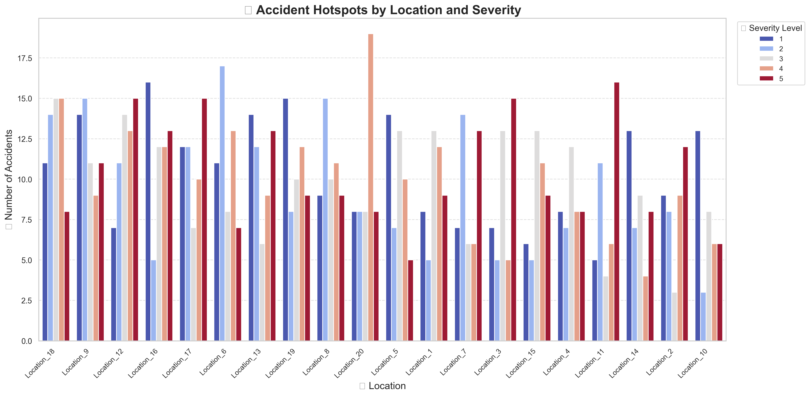

# 🚗 Traffic Accident Hotspot Analysis 🗺️

This project generates a **synthetic dataset** of traffic accidents and visualizes accident **hotspots by location and severity** using Python and Seaborn.

---

## 📊 Objective

To analyze and visualize where accidents occur most frequently and how **accident severity** varies by **location**. This simulation helps demonstrate data visualization techniques useful for real-world traffic and urban safety analysis.

---

## 🛠️ Features

- Generates **1,000 synthetic accident records**
- Includes attributes like:
  - `Road_Condition` (Dry, Wet, Icy, Snowy)
  - `Weather_Condition` (Clear, Rain, Fog, Snow)
  - `Time_of_Day` (Morning, Afternoon, Evening, Night)
  - `Accident_Severity` (Scale 1–5)
  - `Location` (20 unique locations)
- Creates a **visually appealing countplot** using Seaborn to show accident density and severity across locations

---

## 📁 Dataset Example

| Accident_ID | Road_Condition | Weather_Condition | Time_of_Day | Accident_Severity | Location     |
|-------------|----------------|-------------------|-------------|-------------------|--------------|
| 1           | Dry            | Clear             | Afternoon   | 4                 | Location_11  |
| 2           | Dry            | Rain              | Night       | 2                 | Location_20  |
| ...         | ...            | ...               | ...         | ...               | ...          |

---

## 📌 Visualization Sample



> The plot shows the number of accidents at each location, color-coded by severity level (1–5).

---

## 🧪 How It Works

1. Generate synthetic accident data using Python's `random` module.
2. Convert to `pandas` DataFrame and save as CSV.
3. Create a **countplot** using `Seaborn` with:
   - Ordered x-axis by accident count
   - `coolwarm` color palette for clarity
   - Bold titles, improved legends, and emoji labels for visual appeal
4. Save output as `accident_hotspots_enhanced.png`.

---

## 🧰 Requirements

```bash
pip install pandas matplotlib seaborn
